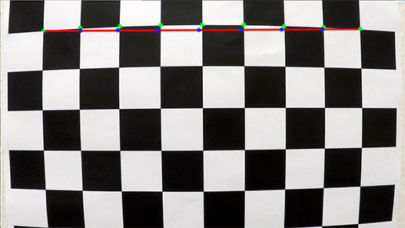
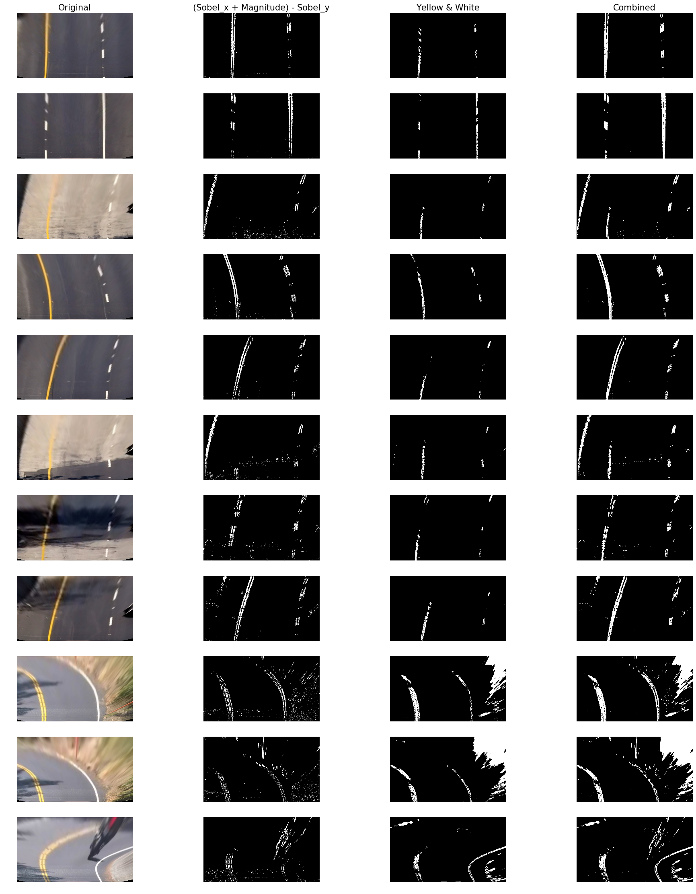
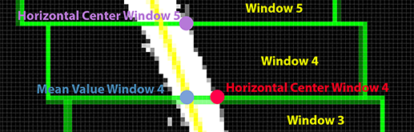

# Advanced Lane Finding Project

The goals / steps of this project are the following:

* Compute the camera calibration matrix and distortion coefficients given a set of chessboard images.
* Apply a distortion correction to raw images.
* Use color transforms, gradients, etc., to create a thresholded binary image.
* Apply a perspective transform to rectify binary image ("birds-eye view").
* Detect lane pixels and fit to find the lane boundary.
* Determine the curvature of the lane and vehicle position with respect to center.
* Warp the detected lane boundaries back onto the original image.
* Output visual display of the lane boundaries and numerical estimation of lane curvature and vehicle position.

[//]: # (Image References)

[image1]: ./examples/undistort_output.png "Undistorted"
[video1]: ./project_video_sven.mp4 "Video"

## [Rubric](https://review.udacity.com/#!/rubrics/571/view) Points

In this writeup I will consider the rubric points individually and describe how I addressed each point in my implementation.  

The implementation can be found in a Jupyter notebook. To run it change to the base folder which contains the `carnd-advanced-lane-lines.ipynb`. Then run:

```
> conda env create -f environment.yml
> source activate carnd-advanced-lane-lines
> jupyter notebook carnd-advanced-lane-lines
```

For easier reference I also split some of the code into smaller files available in the `src` directory.

## Camera Calibration

##### 1. Briefly state how you computed the camera matrix and distortion coefficients. Provide an example of a distortion corrected calibration image.

---  

In order to calibrate the camera we are provided with 20 images of a chessboard taken from different angles and distances with the camera. The chessboard has 9 inner corners in x direction (left to right) and 6 inner corners in y direction (top to bottom). An inner corner is the point where 4 squares (two black ones and two white ones) meet.

Looking at the inner corners in the first row of image `./camera_cal/calibration1.jpg` we can detect the green marked points (we refer to them as *imagepoints*). Since these points form a line in reality but not in the image, the image is said to be **distorted**.

If the image would not be distorted then we would (roughly) have the blue marked points instead of the green marked points (the blue marked points are referred to as *objectpoints*).



So what we need is a transformation where the green marked points become the blue marked points.

The method `getImagePoints` from class `Camera` (`src/camera.py`) encapsulates the detection of inner corners in one chessboard image. It takes the file name of the image and then:

* resizes it to a size of 1280x720. This is because there are some images which have a size of 1281x721 and we need all of them to be the same size.
* converts it to a grayscale image. This is because `cv2.findChessboardCorners` needs a n 8-bit input image.
* runs `cv2.findChessboardCorners` and returns the coordinates (*imagepoints*) of the corners it found.

`getImagePoints` is not able to find corners in the images

* ./camera_cal/calibration1.jpg
* ./camera_cal/calibration4.jpg
* ./camera_cal/calibration5.jpg

The *objectpoints* are the (x, y, z) coordinates of the inner corners in the real world. We can assume that the image was on flat surface (wall or table) when the picture was taken, so we assume z to be 0. The exact coordinates of the *objectpoints* are not critical, but all points for one row must form a line and the distance between points must be constant (refer to the blue marked points in the above image).

With the imagepoints and objectpoints available the camera can be calibrated using the OpenCV funtion `cv2.calibrateCamera()` which gives us the camera matrix and the distortion coefficients (line 33-36 in `src/camera.py`):
```
ret, mtx, dist, rvecs, tvecs = cv2.calibrateCamera(
  objPointsAllImages, imgPointsAllImages, (height, width), None, None)

self.mtx = mtx
self.dist = dist
```
With the camera matrix and the distortion coefficients we then can undistort images (line 60-62 in `src/camera.py`):

```
def undistort(self, image_BGR):
    undistorted = cv2.undistort(image_BGR, self.mtx, self.dist, None, self.mtx )
    return undistorted
```

Using the `undistort` method on the chessboard image `./camera_cal/calibration2.jpg` gives the following result:


## Pipeline (test images)

##### 1. Provide an example of a distortion-corrected image
---
An undistorted version of every test image is available in the folder `./test_images_undistorted`. In the following image you can see the original version of `./test_images/test5.jpg` in the upper left corner and the undistorted version in the upper right corner. Since it is hard to spot the difference this way in the bottom of the image both versions are overlaid with some transparency to visualize the difference.


##### 2. Describe how (and identify where in your code) you performed a perspective transform and provide an example of a transformed image.
---
We use perspective transformation to change the view (perspective) from the original camera view to a birds-eye camera view.

This transformation is defined through a transformation matrix (`birds-eye view = transformation matrix * car-camera view`). To derive it we need 4 source points and 4 destination points.

Therefore I took test image `./test_images/straight_lines2.jpg` and selected 2 points on the left lane (`top_left_src`, `bottom_left_src`) and 2 points on the right lane (`top_right_src`, `bottom_right_src`).


Next I choose 4 points (`top_left_dst`, `bottom_left_dst`, `top_right_dst`, `bottom_right_dst`) so that the lines given by (`top_left_dst`, `bottom_left_dst`) and (`top_right_dst`, `bottom_right_dst`) are parallel.
The following points have been chosen (lines 6-24 in `src/perspective_transform.py`):

```
top_left = (588 , 454)
top_right = (696 , 454)
bottom_right = (1049, 684)
bottom_left = (269, 684)

self.src_points = np.float32([
        (588 , 454),    # top_left
        (696 , 454),    # top_right
        (1049, 684),    # bottom_right
        (269, 684)])    # bottom_left

self.dst_points = np.float32([
        (320, 0),       # top_left
        (960, 0),       # top_right
        (960, 720),     # bottom_right
        (320, 720)])    # bottom_left

self.M = cv2.getPerspectiveTransform(self.src_points, self.dst_points)
self.invM = cv2.getPerspectiveTransform(self.dst_points, self.src_points)
```

The following image highlights the polygons specified by `src_points` (left image) and by `dst_points` (right image)

 

Having the transformation matrix and its inverse available (with help of `cv2.getPerspectiveTransform`) changing the perspective for a given image is handled by the methods `toBirdsEyeView` and `toCarCameraView` (lines 26-30 in `src/perspective_transform.py`):

```
def toBirdsEyeView(self, img):
    return cv2.warpPerspective(img, self.M, (img.shape[1], img.shape[0]))

def toCarCameraView(self, img):
    return cv2.warpPerspective(img, self.invM, (img.shape[1], img.shape[0]))

```

Below is the result for all test images (also available in `./test_images_perspective`). Every image has been undistorted and then perspective has been changed from car camera view to birds-eye view:


##### 3. Describe how (and identify where in your code) you used color transforms, gradients or other methods to create a thresholded binary image.  Provide an example of a binary image result.
---
The two options proposed in the lecture are color thresholding and gradients.

###### Color Thresholding
First I had a look at color thresholding. Lane lines are typically yellow or white. Finding the right RGB values for thresholding is not very intuitve. So I used HSV (Hue Saturation Value) as a color model instead.


From the image above we can see that for white the value of saturation is most relevant and for yellow the value of hue is most relevant. Possible values for hue are in the range 0 - 360, and for saturation and value in the range 0 - 100

To account for different light conditions I found out the the following thresholds give good results:

| Color         | min_threshold             | max_threshold                     |
|:-------------:|:-------------:            |:-------------:                    |
|Yellow         | h = 28, s = 28, v = 50    | h = 58, s = 100, v = 100          |
|White          | h = 20, s = 0, v = 75     | h = 360, s = 10, v = 100           |

This is captured in class `ColorThresholding` (`src/color_thresholding.py`). The actual work is done in method `_thresholdColor`. First I have to normalize the value for hue, saturation, value so it is in the range of 0 - 255 and then I rely on the OpenCV function `cv2.inRange` to filter for the pixels:

```
def _thresholdColor(self, image_BGR, min_thresh, max_thresh):

    min_thresh_normalized = (min_thresh[0] * 0.7, min_thresh[1] * 2.55, min_thresh[2] * 2.55)
    max_thresh_normalized = (max_thresh[0] * 0.7, max_thresh[1] * 2.55, max_thresh[2] * 2.55)

    image_HSV = cv2.cvtColor(image_BGR, cv2.COLOR_BGR2HSV).astype(np.float)
    hsv_filtered = cv2.inRange(image_HSV, min_thresh_normalized, max_thresh_normalized)

    return hsv_filtered
```

Here is the result of color thresholding for all test images:


###### Gradient thresholding

Second I had a look at gradient thresholding. There are different filters (Sobel Operator, Magnitude of Gradient, Direction of Gradient) which can be used to detect lines. These are implemented as methods of class `SobelThresholding` (`src/sobel_thresholding.py`). The actual work is done by the OpenCV function `cv2.Sobel`. For example in line 8 of `src/sobel_thresholding.py` the function is called to detect lines in x direction.

```
sobel = cv2.Sobel(gray, cv2.CV_64F, 1, 0)
```

Finding working thresholds was a trial and error process, finally I sticked with these thresholds:

| Filter         | min             | max                     |
|:-------------:|:-------------:   |:-------------:                    |
|Sobel x         | 15    | 120     |
|Sobel y         | 10    | 120     |
|Magnitude        | 20    | 120     |

In the below image the gradient thresholding is visualized:


Combining the gradient thresholding and the color thresholding requires some further explanation where looking at the code is helpful. The logic is located in the method `detectLanePixels` of class `PixelSelection` (`src/pixel_selection.py`):

```
def detectLanePixels(self, image_BGR):
    colors =self.ct.extractWhiteAndYellow(image_BGR)
    gray = cv2.cvtColor(image_BGR, cv2.COLOR_BGR2GRAY)
    sobel_x = self.st.sobel_thresh(gray, orient='x', sobel_thresh=(15, 120))
    sobel_y = self.st.sobel_thresh(gray, orient='y', sobel_thresh=(10, 120))
    magnitude = self.st.mag_thresh(gray, mag_thresh=(20, 120))

    sobel = np.zeros_like(sobel_x)
    combined = np.zeros_like(sobel_x)

    sobel[((magnitude == 1) | (sobel_x == 1))] = 1
    sobel[(sobel_y == 1)] = 0
    combined[((colors == 1) | (sobel == 1))] = 1
    combined = cv2.blur(combined,(5,5))

    return combined

```

First we can see the thresholds from the above table in the code. After we have calculated the individual masks (`colors`, `sobel_x`, `sobel_y` and `magnitude`) we need to combine them. The `sobel_x` and `magnitude` filter do a pretty good job at detecting the line, but they also detect some noise at the bottom of the picture.
This noise seems to be included in `sobel_y`, which detects also a fraction of the lane lines.

Therefore I take the following approach I take the pixels identified by `sobel_x` and `magnitude` and then remove the pixels identified by `sobel_y`. With this I can reduce the noise at the bottom of the image without loosing to much information about the lane lines. Finally I combine this with all pixels identified by `colors` and then apply a blur to smoothen it. In the following image you can see the result of gradient thresholding ((`sobel_x` + `magnitude`) - `sobel_y`) the result of color thresholding and their combination:



##### 4. Describe how (and identify where in your code) you identified lane-line pixels and fit their positions with a polynomial?
---
Once we have the image transformed and identified the pixels which likely belong to a lane we can start finding the lane line. For this I need the concept of a search window:

###### Search Window
In a window we search for all points where the value is 1 (e.g. Window 4 in the below image). From every identified point we take the x-coordinate and then take the mean of these values (light blue point in the below image). This mean value is used to adjust the horizontal center of the next window (light purple point in the below image). So the mean value of x-coordinates from `window n` becomes the horizontal center of `window n+1`.



However we are only going to change the horizontal center of `window n+1` if there are more than 230 points (`self.minpix = 230` in class `LaneFinder`) used when calculating the mean of x-coordinates of `window n`. This way we avoid being too sensitive and jumping around.

Search Windows are constructed by the methods `getWindowLeft` and `getWindowRight` from the class `WindowFactory`  (line 29-66 in `src/lane_finder.py`).
A search window is specified through its `top_left` and `bottom_right` point. The methods `getWindowLeft` and `getWindowRight` calculate these two points based on the window number (determines the y-coordinates of the window) and the horizontal center (determines the x-coordinates of the window).

Having the points of a search window available it is easy to find the non-zero pixels (`getNonZeroPixels` in class `Window`) in it and to calculate the mean (`getMeanXofNonZeroPixels` in class `Window`).

###### Points for line fitting
We start at the bottom of the picture, creating the first window for the left lane and the right lane. Since we do not have a predecessor for the first window, there is no mean value of x-coordinates from the previous window we could use as horizontal center of the first window. Therefore we split the image into 4 quadrants (Top left, top right, bottom left, bottom right quadrant). In the image below the bottom_left quadrant is marked by the orange rectangle. We take the mean value of lane line x-coordinates in this quadrant, so the mean value of the x-coordinates of all red points in the orange quadrant.)


When we have the first window we continue to create windows as described above until we reached window 15. As we go we record all the pixels which have been found in the 15 windows for the left lane and in the 15 windows for the right lane. With these points we can instantiate objects of class `Lane`.


We then fit one second order polynomial to the sum of all left-lane points and one second order polynomial to the sum of all right-lane points. This happens in the constructor of class `Lane` (line 21):

```
coefficients = np.polyfit(self.yCoords * YM_PER_PIX, self.xCoords * XM_PER_PIX, 2)
```

###### Fast lane line detection

Once I have a fitted lane line available I can use it to limit the space where I look for lane line pixels in the next image and do not need to do all the steps described in *Points for line fitting*.

This is implemented as method `detectLanesFast` of class `LaneFinder`. First I take the coefficients of the latest detected left lane to derive the search space for the current image and then I do the same for the latest detected right lane:

```
a,b,c = self.lastLeftLane.getCoeffs()
left_lane_inds = ((nonzerox > (a*(nonzeroy**2) + b*nonzeroy + c - margin)) & (nonzerox < (a*(nonzeroy**2) + b*nonzeroy + c + margin)))
a,b,c = self.lastRightLane.getCoeffs()
right_lane_inds = ((nonzerox > (a*(nonzeroy**2) + b*nonzeroy + c - margin)) & (nonzerox < (a*(nonzeroy**2) + b*nonzeroy + c + margin)))
```

`nonzerox` and `nonzery` are from the current image and by combining this with the search space (`left_lane_inds` and `right_lane_inds`) I get the coordinates of potential lane line pixels without performing a complete window search:

```
x_coords_left_lane = nonzerox[left_lane_inds]
y_coords_left_lane = nonzeroy[left_lane_inds]
x_coords_right_lane = nonzerox[right_lane_inds]
y_coords_right_lane = nonzeroy[right_lane_inds]
```

##### 5. Describe how (and identify where in your code) you calculated the radius of curvature of the lane and the position of the vehicle with respect to center.
---
The curvature and therfore the radius of curvature is a property of the lane and therefore it is a method in the `Lane` class. It is calculated according to the formula


This is simply translated into code and captured in the method `getRadiusOfCurvatureWorldSpace` of class `Lane`:

```
def getRadiusOfCurvatureWorldSpace(self, yCoord):
    dividend = (1 + (self.A_rw * yCoord + self.B_rw) ** 2) ** 1.5
    divisor = np.absolute(2 * self.A_rw)
    curverad = dividend / divisor
    return curverad
```

Note that the coefficients used here (`self.A_rw` and `self.B_rw`) are from the polynomial fit where the points have been mapped into real world space before fitting a line. This happens in the constructor of the class `Lane` where `YM_PER_PIX` and `XM_PER_PIX` are constants associating a height and width in meters for a pixel:

```
coefficients = np.polyfit(self.yCoords * YM_PER_PIX, self.xCoords * XM_PER_PIX, 2)
```

The position of the vehicle is calculated in the method `addMetadata`, respectively `__getPositionRelativeToCenter` of class `OverlayHelper`. For calculating the points I use the fact that I know the image size and that the camera is mounted in the center of ther car.
```
def __getPositionRelativeToCenter(self, height = 720, width = 1280):
    left_lane_bottom_x = self.left_lane.getXCoord(height)
    right_lane_bottom_x = self.right_lane.getXCoord(height)
    center_point = (left_lane_bottom_x + right_lane_bottom_x)/2
    center_distance = (width/2 - center_point)
    return center_distance

```

##### 6. Provide an example image of your result plotted back down onto the road such that the lane area is identified clearly.
---
Based on the fitted line for the `left_lane` and the `right_lane` we can create an image which contains the identified lane area. The code for this functionaly is encapsulated in the class `OverlayHelper`. First a polygon is created for every lane, which is done by duplicating the points of the fitted line and then shifting the original points a little bit to the left (subtracting a small value from the x-coordinate) and the duplicated points a little bit to the right (adding a small value to the x-coordinate). Then the points of the left lane and the right lanes are combined for the polygon which covers the area between the lanes. To draw the ploygons on a new image (called overlay) the OpenCV function `cv2.fillPoly` is used.

The result looks like this:


For the complete pipeline I have to change the perspective for the overlay back to the car camera view which is done using the inverse matrix retrieved in camera calibration.

```
# 5. create the overlay
oh = OverlayHelper(left_lane, right_lane)
street_overlay_birds_eye_view = oh.createOverlay(warped)
street_overlay_car_camera_view = pt.toCarCameraView(street_overlay_birds_eye_view)

# 6. combine the overlay
combined = oh.addOverlay(street_overlay_car_camera_view, image_BGR)

# 7. write the metadata on the image
oh.addMetadata(combined, XM_PER_PIX)
```

The final result for all test images are visualized here:


As you can see the parameters for thresholding are not perfect for the last three pictures which I extracted from the harder challenge video.

---

## Pipeline (video)

##### 1. Provide a link to your final video output.  Your pipeline should perform reasonably well on the entire project video (wobbly lines are ok but no catastrophic failures that would cause the car to drive off the road!).
---

All the individual steps are put in sequence in the method `run` of class `ImagePipeline` (`src/image_pipeline.py`) which is then executed on every frame of the video:

```
def run(self, image_RGB):

    # moviepy reads in the image as RGB, but the pipeline is based on BGR
    image_BGR = cv2.cvtColor(image_RGB, cv2.COLOR_RGB2BGR)

    # 1. undistort the image
    undistorted = self.camera.undistort(image_BGR)

    # 2. perspective transformation
    perspective = PerspectiveTransform()
    warped = perspective.toBirdsEyeView(undistorted)

    # 3. find potential lane pixels
    ps = PixelSelection()
    binary_warped = ps.detectLanePixels(warped)

    # 4. derive the lanes
    laneFinder = LaneFinder(binary_warped,
                            15,
                            self.lastLeftLanes,
                            self.lastRightLanes,
                            interactiveMode = False)
    left_lane, right_lane = laneFinder.detectLanes()


    self.lastLeftLanes.append(left_lane)
    self.lastRightLanes.append(right_lane)
    if(len(self.lastLeftLanes) > 5):
        self.lastLeftLanes.popleft()
        self.lastRightLanes.popleft()

    # 5. create the overlay
    oh = OverlayHelper(left_lane, right_lane)
    street_overlay_birds_eye_view = oh.createOverlay(warped)
    street_overlay_car_camera_view = pt.toCarCameraView(street_overlay_birds_eye_view)

    # 6. combine the overlay
    combined = oh.addOverlay(street_overlay_car_camera_view, undistorted)

    # 7. write the metadata on the image
    oh.addMetadata(combined, XM_PER_PIX)

    output = cv2.cvtColor(combined, cv2.COLOR_BGR2RGB)

    return output
```

Here's a [link to my video result](./project_video_sven.mp4)

---

## Discussion

##### 1. Briefly discuss any problems / issues you faced in your implementation of this project.  Where will your pipeline likely fail?  What could you do to make it more robust?
---

This was a very interesting project and it took me ages (much more than the 10 hours per week planned ;)) to play around with the parameters to find something that works ok. One issue is certainly that my gradient thresholding could mislead me, in cases where the road has been patched. E.g. in the following image it would likely detect 3 lines in x-direction:


Another issue is with objects which are on the road. In the following image my gradient thresholding is likely to consider the motorbike and its drive as a possible lane line:


Furthermore I think that for a real car it might make sense to do some of the operations in frequency space since that would be computationally faster, I don't think my current solution works in realtime.

One improvement I could imagine is to build in more sanity checks and so discard points because they are unrealistic.  
